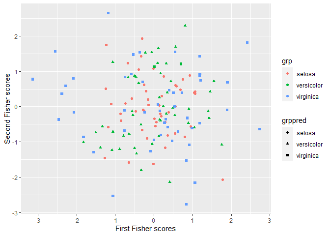

<!-- README.md is generated from README.Rmd. Please edit that file -->

# `mlrob`: Data preprocessing techniques and tools for classification

## Installation

The `mlrob` package is not yet on CRAN (The Comprehensive R Archive
Network)

    ##    install.packages("mlrob")

## Building from source

To install the latest stable development version from GitHub, you can
pull this repository and install it using

    ## install.packages("remotes")
    remotes::install_github("valentint/mlrob")

Of course, if you have already installed `remotes`, you can skip the
first line (I have commented it out).

## Example

This is a basic example which shows you if the package is properly
installed:

``` r
library(mlrob)
#> Loading required package: ggplot2
dd <- get_data("Iris")
#> 
#> Iris: n= 150 p= 4 ng= 3 ...
(out <- LdaFisher(dd$x, dd$grp))
#> --------------------------------------
#> Results from Fishers discriminant analysis
#> - Variance between the classes: 
#>            [,1]       [,2]      [,3]       [,4]
#> [1,]  1.2642427 -0.3990533  3.304968  1.4255867
#> [2,] -0.3990533  0.2268987 -1.144792 -0.4586533
#> [3,]  3.3049680 -1.1447920  8.742056  3.7354800
#> [4,]  1.4255867 -0.4586533  3.735480  1.6082667
#> 
#> - Variance within the classes: 
#>              Sepal.Length Sepal.Width Petal.Length Petal.Width
#> Sepal.Length   0.26500816  0.09272109   0.16751429  0.03840136
#> Sepal.Width    0.09272109  0.11538776   0.05524354  0.03271020
#> Petal.Length   0.16751429  0.05524354   0.18518776  0.04266531
#> Petal.Width    0.03840136  0.03271020   0.04266531  0.04188163
#> 
#> - Loadings matrix: 
#>            [,1]      [,2]        [,3]       [,4]
#> [1,] -1.2283441 -2.940449  0.02410215  0.8293776
#> [2,] -0.7253360  2.582248  2.16452123  1.5344731
#> [3,] -0.9928175  2.844241 -0.93192121 -2.2012117
#> [4,]  3.1879558 -3.263379  2.83918785 -2.8104603
#> --------------------------------------
plot(out)
```

<!-- -->
